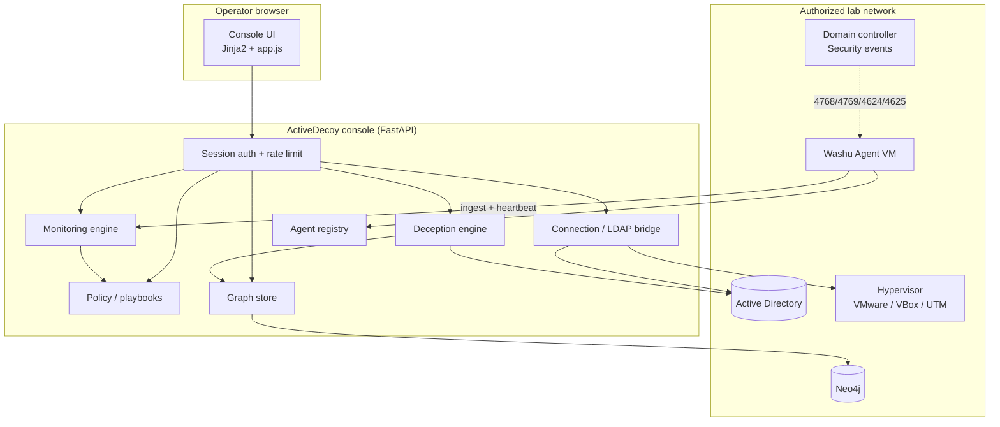
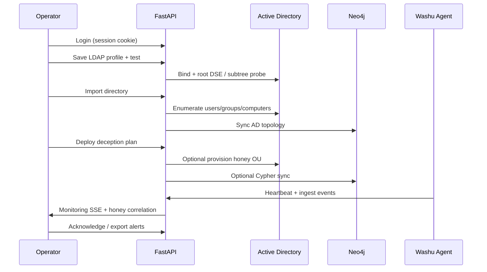

# ActiveDecoy architecture

ActiveDecoy is a single-process **FastAPI** application with server-rendered UI, optional **Neo4j** graph storage, **LDAP** directory integration, and a separate **Washu Agent** forwarder for telemetry.

## System context

## Request flow (happy path)

## Repository modules

| Path | Responsibility |
|------|----------------|
| `app/main.py` | App factory, pages, deception deploy routes |
| `app/api/` | REST routers (connection, graph, monitoring, agents, policy) |
| `app/core/` | Engines, config, LDAP/AD provisioner, persistence |
| `app/templates/` + `app/static/` | Dashboard UI |
| `washu_agent/` | Lab monitoring forwarder (CLI package) |
| `data/` | Sample graph, user guide, gitignored runtime JSON |
| `scripts/` | Bootstrap, demo, sample ingest |
| `tests/` | Unit, mocked integration, E2E API |

## Persistence

| Store | Path | Contents |
|-------|------|----------|
| Deployments | `data/deployments.json` | AD provision history |
| Monitoring events | `data/monitoring_events.json` | Telemetry feed |
| Agent registry | `data/agents.json` | Washu heartbeats |

Session state (connection profile metadata, last deployment) lives in the **signed session cookie**. LDAP/hypervisor passwords are in a **server-side secret store**, not the cookie.

## Trust boundaries

1. **Console** — admin session; must stay on a management network.
2. **Honey OU** — isolated AD container; deny-logon GPO per Policy page.
3. **Washu Agent** — read-only toward DC logs; push-only to ingest API with `AGENT_INGEST_TOKEN`.
4. **Neo4j** — graph mirror; no direct AD write path.

## Security controls (lab)

- `ENFORCE_SECURE_DEFAULTS` blocks default secrets on shared labs
- Login rate limiting (`LOGIN_RATE_LIMIT`)
- CORS allowlist (`CORS_ORIGINS`)
- Audit logger `activedecoy.audit` for sensitive actions
- Policy gate blocks AD provision when honey OU / naming checks fail

## Extension points

- Real GPO application (today: artifacts + checklist)
- OIDC/LDAP console login (today: env admin credentials)
- Multi-DC event correlation (today: single-lab ingest + `AD_MONITORED_DOMAINS`)
